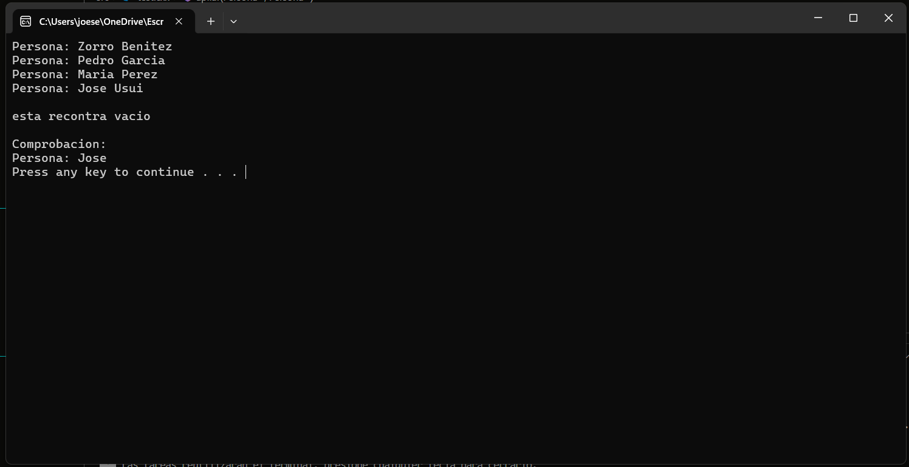

# TESTCPP

## Descripción

El propósito de este proyecto no es más que la de poner a prueba los códigos desarrollados en c++.

## En Funcionamiento

### Compilador

Se utilizo la version MinGW-w64 en su ultima version 13.2.0.

### Extension

Se utilizaron unicamente las extensiones con la firma de Microsoft.

### Lanzador (launch)

Para estas configuraciones de .vscode, es necesario que todos los ejecutable del compilador funcionen correctamente. Una vez que uno se cercioro de esto, lo único que queda es verificar que todas las direcciones del ejecutable del compilador estén correctas.

## Autor

- Usui, José Fernando